AWS 서버리스 서비스를 이용한 웹 애플리케이션 구축하기 Hands-on Lab
====

이 실습은 301 레벨로, **Cloud9**을 이용해서 아래의 Lab1을 진행하고, **CodeStar**를 이용해서 Lab2를 진행합니다. 도전과제를 통해서 Lab2의 환경에 Lab1의 개발 코드를 배포하여 CICD 배포 파이프라인을 구축할 수 있습니다.
* Lab1에서는  **Cloud9 IDE**를 이용하여 웹 애플리케이션 구축을 위하여  **프로젝트를 생성**하고,  **코드를 생성**하고, **SAM(Serverless Architecture Model) 템플릿**을 직접 만들어  배포 하는 방법을 학습합니다.
* Lab2에서는 **CodeStar**를 이용하여 DevOps 환경으로 서버리스 서비스를 활용한 CI/CD 프로세스를 구축하여 빌드 단계에서  **단위 테스트**를 하고  **Canary 배포**와  **롤백** 방법을 학습합니다.

## 실습 소개
### 실습 목적
1. **Cloud9을 이용하여 서버리스 애플리케이션을 SAM(Serverless Application Model) 기반으로 개발/배포할 수 있습니다.** 
    - Cloud9 IDE
1. **SAM을 이해하고 서버리스 서비스에 필요한 서비스를 직접 기술 할 수 있습니다.**
    - API Gateway, Lambda, DynamoDB, S3, SNS
1. **서버리스 애플리케이션을 AWS Code 시리즈를 이용하여 배포 프로세스를 제작할 수 있습니다.**
    - CodePipeline, CodeCommit, CodeBuild, CloudFormation(SAM), CodeDeploy
1. X-ray를 이용하여 서버리스 서비스에 대한 모니터링 및 디버깅을 할 수 있습니다.

### 실습 비용
해당 실습은 3시간 기준으로 비용을 예측합니다. 프리티어 기준으로 비용이 발생하지 않는 범위내에서 실습을 진행할 수 있습니다.
마지막 도전과제 수행시 CodePipeline이 증가하면서 비용이 발생할 수 있는 부분이 있으므로 실습 후 리소스를 반드시 삭제해야 합니다.

<small>
<table class="ImportedHTMLTable">
<colgroup> <col/> <col/> <col/> <col/> <col/> <col/> <col/> </colgroup><tbody><tr><th class="confluenceTh">Service</th><th class="confluenceTh">Sub Service</th><th class="confluenceTh">Unit</th><th class="confluenceTh">Pricing</th><th class="confluenceTh">Use</th><th class="confluenceTh">free tier(12개월)</th><th colspan="1" class="confluenceTh">etc</th></tr><tr><td rowspan="2" class="confluenceTd"><a href="https://aws.amazon.com/ko/cloud9/pricing/" class="external-link" rel="nofollow">Cloud9</a></td><td class="confluenceTd">EC2 - t2.micro</td><td class="confluenceTd">1 h</td><td class="confluenceTd">$0.0116/Hour</td><td class="highlight-green confluenceTd" data-highlight-colour="green">t2.micro 2hour</td><td class="confluenceTd">750hour/month</td><td colspan="1" class="confluenceTd"><br/></td></tr><tr><td class="confluenceTd">EBS - 8GB</td><td class="confluenceTd">1 m</td><td class="confluenceTd">$0.1/GB</td><td class="highlight-green confluenceTd" data-highlight-colour="green">8GB 2hour</td><td class="confluenceTd">30GB/month</td><td colspan="1" class="confluenceTd"><br/></td></tr><tr><td class="confluenceTd"><a href="https://aws.amazon.com/ko/lambda/pricing/" class="external-link" rel="nofollow">Lambda</a></td><td class="confluenceTd">-</td><td class="confluenceTd">128MB</td><td class="confluenceTd"><span style="color: rgb(51,51,51);">$0.000000208/100ms</span></td><td class="highlight-green confluenceTd" data-highlight-colour="green">1,000번 이하</td><td class="confluenceTd">100만번 요청<br/>320만 초 실행</td><td colspan="1" class="confluenceTd">1년후 만료 없음</td></tr><tr><td class="confluenceTd"><a href="https://aws.amazon.com/ko/api-gateway/pricing/" class="external-link" rel="nofollow">API Gateway</a></td><td class="confluenceTd">-</td><td class="confluenceTd"><br/></td><td class="confluenceTd">1백만 API 호출당 $3.50<br/>처음 10TB에 대해 $0.09/GB</td><td class="highlight-green confluenceTd" data-highlight-colour="green">1,000번 이하</td><td class="confluenceTd"><p>호출 100만건<br/>처음 10TB에 대해 $0.09/GB</p></td><td colspan="1" class="confluenceTd"><br/></td></tr><tr><td class="confluenceTd"><a href="https://aws.amazon.com/ko/dynamodb/pricing/" class="external-link" rel="nofollow">DynamoDB</a></td><td class="confluenceTd">-</td><td class="confluenceTd"><br/></td><td class="confluenceTd"><span style="color: rgb(51,51,51);">WCU당 최소 $0.47</span> <br/>RCU당 최소 $0.09<br/>GB당 최소 $0.25</td><td class="highlight-green confluenceTd" data-highlight-colour="green">WCU 5<br/>RCU 5<br/>스토리지 100M</td><td class="confluenceTd"><p>매달 2억건 요청<br/>WCU 25 / RCU 25<br/>인덱싱된 데이터 스토리지 25G</p></td><td colspan="1" class="confluenceTd">1년 후 <br/>지속 제공</td></tr><tr><td colspan="1" class="confluenceTd"><a href="https://aws.amazon.com/ko/sns/pricing/" class="external-link" rel="nofollow">SNS</a></td><td colspan="1" class="confluenceTd">-</td><td colspan="1" class="confluenceTd"><br/></td><td colspan="1" class="confluenceTd">처음 1GB/월 $0.000 GB당<br/>최대 10TB/월 $0.090 GB당</td><td class="highlight-green confluenceTd" colspan="1" data-highlight-colour="green">100M 이하</td><td colspan="1" class="confluenceTd"><span style="color: rgb(51,51,51);">매달 15GB의 데이터 전송</span></td><td colspan="1" class="confluenceTd"><br/></td></tr><tr><td colspan="1" class="confluenceTd"><a href="https://aws.amazon.com/ko/polly/pricing/" class="external-link" rel="nofollow">Polly</a></td><td colspan="1" class="confluenceTd">-</td><td colspan="1" class="confluenceTd"><br/></td><td colspan="1" class="confluenceTd">1백만 문자당 $4</td><td class="highlight-green confluenceTd" colspan="1" data-highlight-colour="green">1,000 문자 이하</td><td colspan="1" class="confluenceTd">매달 문자 500만개</td><td colspan="1" class="confluenceTd"><br/></td></tr><tr><td rowspan="5" class="confluenceTd">CodeStar</td><td class="confluenceTd"><a href="https://aws.amazon.com/ko/codepipeline/pricing/" class="external-link" rel="nofollow">CodePipeline</a></td><td class="confluenceTd"><br/></td><td class="confluenceTd"><span style="color: rgb(51,51,51);">월별 활성 파이프라인*당 $1</span></td><td class="highlight-yellow confluenceTd" data-highlight-colour="yellow">2개 (도전과제 시도시)</td><td class="confluenceTd"><span style="color: rgb(51,51,51);">매월 활성 파이프라인 1개</span></td><td colspan="1" class="confluenceTd"><br/></td></tr><tr><td class="confluenceTd"><a href="https://aws.amazon.com/ko/codecommit/pricing/" class="external-link" rel="nofollow">CodeCommit</a></td><td class="confluenceTd"><br/></td><td class="confluenceTd">최초 5명 초과시 <span style="color: rgb(51,51,51);">월별 $1<br/>GB당 $0.06/월 (10GB/월 초과) <br/>Git 요청당 $0.001 (1000회/월 초과)</span></td><td class="highlight-green confluenceTd" data-highlight-colour="green">1개</td><td class="confluenceTd">최초 5명까지<br/>매달 50GB의 스토리지<br/>매달 10,000건의 Git 요청</td><td colspan="1" class="confluenceTd">1년후 만료 없음</td></tr><tr><td colspan="1" class="confluenceTd"><a href="https://aws.amazon.com/ko/codebuild/pricing/" class="external-link" rel="nofollow">CodeBuild</a></td><td colspan="1" class="confluenceTd"><br/></td><td colspan="1" class="confluenceTd">build.general1.small $0.005/분</td><td class="highlight-green confluenceTd" colspan="1" data-highlight-colour="green">30분</td><td colspan="1" class="confluenceTd"><span style="color: rgb(51,51,51);">매월 100 빌드 분의 build.general1.small</span></td><td colspan="1" class="confluenceTd">1년 후 <br/>지속 제공</td></tr><tr><td class="confluenceTd"><a href="https://aws.amazon.com/ko/codedeploy/pricing/" class="external-link" rel="nofollow">CodeDeploy</a></td><td class="confluenceTd"><br/></td><td class="confluenceTd"><span style="color: rgb(51,51,51);">EC2 또는 Lambda에 배포 무료</span></td><td class="highlight-green confluenceTd" data-highlight-colour="green">30회</td><td class="confluenceTd">-</td><td colspan="1" class="confluenceTd"><br/></td></tr><tr><td colspan="1" class="confluenceTd"><a href="https://aws.amazon.com/ko/cloudformation/pricing/" class="external-link" rel="nofollow">CloudFormation</a></td><td colspan="1" class="confluenceTd"><br/></td><td colspan="1" class="confluenceTd">-</td><td class="highlight-green confluenceTd" colspan="1" data-highlight-colour="green">-</td><td colspan="1" class="confluenceTd">-</td><td colspan="1" class="confluenceTd"><br/></td></tr><tr><td class="confluenceTd"><a href="https://aws.amazon.com/ko/s3/pricing/" class="external-link" rel="nofollow">s3</a></td><td class="confluenceTd">-</td><td class="confluenceTd"><br/></td><td class="confluenceTd">PUT, COPY, POST 또는 LIST 요청 $0.005/1,000건<br/>GET, SELECT 및 기타 모든 요청 $0.0004/1,000건<br/>처음 50TB/월 $0.023/GB</td><td class="highlight-green confluenceTd" data-highlight-colour="green"><p>Put 100번 내외</p><p>GET 2,000번 내외</p></td><td class="confluenceTd">매달 5GB 스토리지<br/>Get 요청 20,000건<br/>Put 요청 2,000건</td><td colspan="1" class="confluenceTd"><br/></td></tr></tbody>
</table>
</small>


### 실습 종료 후 리소스 삭제
**<font color="red">실습이 종료되고 나면 리소스를 반드시 삭제해야 합니다.</font>**  해당 실습은 CloudFormation 기반으로 진행됩니다. 즉 실습에 사용한 Stack을 삭제하면, 배포되어 있는 리소스도 함께 삭제할 수 있습니다. 반드시 실습에 사용한 리소스가 삭제되었는지 확인 후 실습을 종료합니다. 만약 S3 버킷에 객체가 남아 있을 경우 해당 버킷이 삭제가 되지 않을 수 있으므로, 해당 S3 버킷을 직접 삭제하고 확인 합니다.


## 서버리스 웹 애플리케이션 구축 방법 소개
아래 다이어그램은 Lab1에서 구축할 서버리스 웹 애플리케이션입니다. 서버리스 서비스를 이용하기 때문에, 프로비저닝, 패치, 확장에 대해 고민할 필요가 없으며, 사용한 만큼만 비용을 지불합니다. 또한, 서버리스 서비스는 완전 관리형 서비스이기 때문에, 개발자는 애플리케이션 개발 자체에만 집중할 수 있습니다. 해당 애플리케이션은 텍스트를 전송하면 해당 텍스트를 읽어주는 기능을 서버리스 서비스 기반으로 개발합니다. Lab2에서는 아래의 RESTful API에 대해서 CI/CD 배포 프로세스를 구축하는 방법에 대해서 자세히 살펴봅니다.
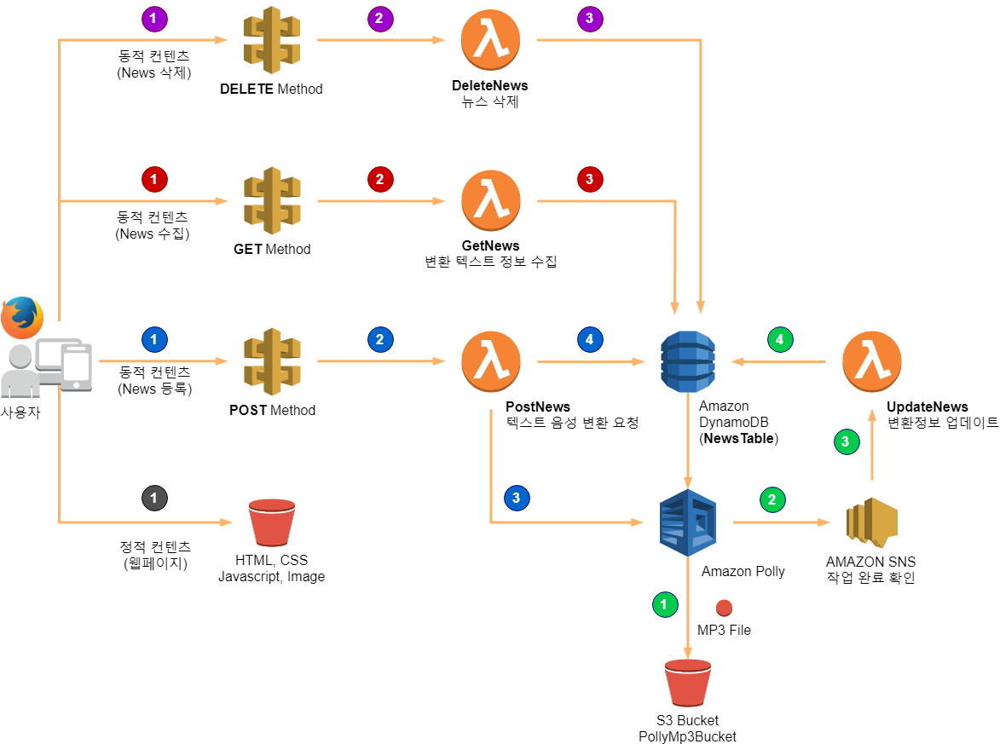

### 애플리케이션의 구성

이 애플리케이션은 다섯 가지 영역으로 구분할 수 있습니다.

1. **정적 웹페이지 구현 - StaticWebBucket**
    1. 이 시나리오는 Amazon S3(Simple Storage Service)에서 호스팅되는 정적 웹 페이지를 기반으로 실행합니다.
1. **새로운 뉴스를 등록 - PostNews**
    1. MP3로 생성할 텍스트 정보는 Amazon API Gateway에 의해 노출된 RESTful API로 수신합니다.
    2. Amazon API Gateway는 MP3 파일 생성 프로세스를 초기화하는 전용 Lambda 함수인 "PostNews"를 설정합니다.
    3. "PostNews" Lambda 함수는 News에 대한 메타 정보를 "NewsTable" DynamoDB 테이블에 저장합니다.
    4. TTS 변환을 비동기적으로 실행하기 위해 Amazon Polly에 StartSpeechSynthesisTask 작업을 예약하고, 작업 ID를 DynamoDB에 추가합니다.
1. **MP3 저장 정보 업데이트 - UpdateNews**
    1. Amazon Polly에서 작업해서 만들어진 MP3 파일은 전용 S3 버킷인 "PollyMp3Bucket"에 저장합니다.
    2. 작업이 완료되면 Topic에 의해서 트리거된 Lambda 함수인 "UpdateNews"를 호출합니다.
    3. "UpdateNews" Lambda 함수는 작업 ID를 확인하고, DynamoDB에 등록된 해당 작업에 대한 상태를 변경합니다. (scheduled → COMPLETE)
1. **등록된 뉴스 정보 검색 - GetNews**
    1. GET 메서드를 이용해서 뉴스에 대한 정보를 검색하는 방법을 제공합니다.
    2. "GetNews" Lambda 함수는 DynamoDB 테이블에서 뉴스 텍스트에 대한 정보와 버킷에 업로드한 MP3 버킷 URL 정보를 제공합니다.
1. **기존 뉴스 삭제 - DeleteNews**
    1. RESTful API로 Delete 메서드를 이용하여 삭제를 요청합니다.
    2. "DeleteNews" Lambda 함수는 DynamoDB에 저장되어 있는 해당 News 항목과 관련되어 생성한 MP3를 삭제합니다.

## 실습

> ⓘ 실습은 Lab1과 Lab2로 구성되어져 있습니다.
> * Lab1에서는 SAM 템플릿을 작성해 나가는 방법과 이해할 수 있습니다.
> * Lab2의 경우 Lab1과 별도로 진행할 수 있도록 구성되어져 있기 때문에 별도로 진행할 수 있습니다.
다만, Lab2는 SAM 템플릿에 대한 이해를 기반으로 빌드 환경을 위한 buildspec을 구성하므로 Lab1 실습 이후에 Lab2를 하는 것을 권장합니다.

### Lab1. Cloud9을 이용한 서버리스 웹 애플리케이션 구축
Lab1은 Cloud9 IDE를 이용하여 서버리스 웹 애플리케이션을 구축하는 방법을 살펴봅니다. 이 실습은 Cloud9이 존재하는 Singapore 리전에서 English 언어로 진행합니다. Cloud9 통합 개발 환경(IDE)은 싱가포르 리전을 사용하지만, 서비스 배포는 다른 리전을 선택할 수 있습니다. 이 실습에서는 Singapore 리전을 그대로 사용하겠습니다.

#### 1. Cloud9 IDE 환경 생성
1. AWS 콘솔 환경에서  Cloud9 서비스로 이동합니다.

2. **Create environment**버튼을 클릭하여 Cloud9 환경을 생성합니다.
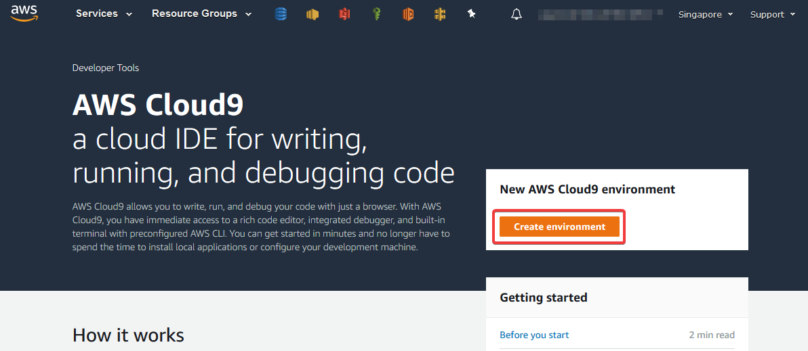
3. Cloud9 이름을 **NewsWebApp**이라고 생성합니다. 설명(**News Web Application using Serverless Service**은 옵션이기 때문에 넣지 않아도 됩니다.
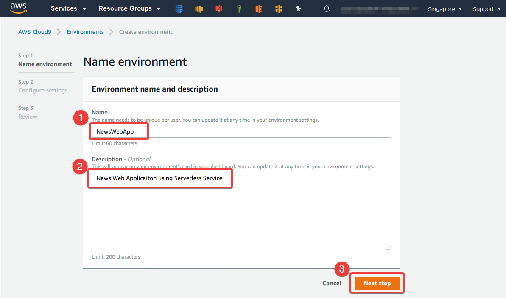
4. Cloud9의 환경설정을 합니다. 개발환경은  **EC2 인스턴스**로 선택하고 인스턴스 타입은  t2.micro  를 선택합니다. 프리티어로 사용할 수 있습니다. Cloud9 IDE를 30분간 사용하지 않으면, 자동으로 EC2 인스턴스가 Stop 되어 비용을 절감할 수 있는 옵션을 기본적으로 제공합니다
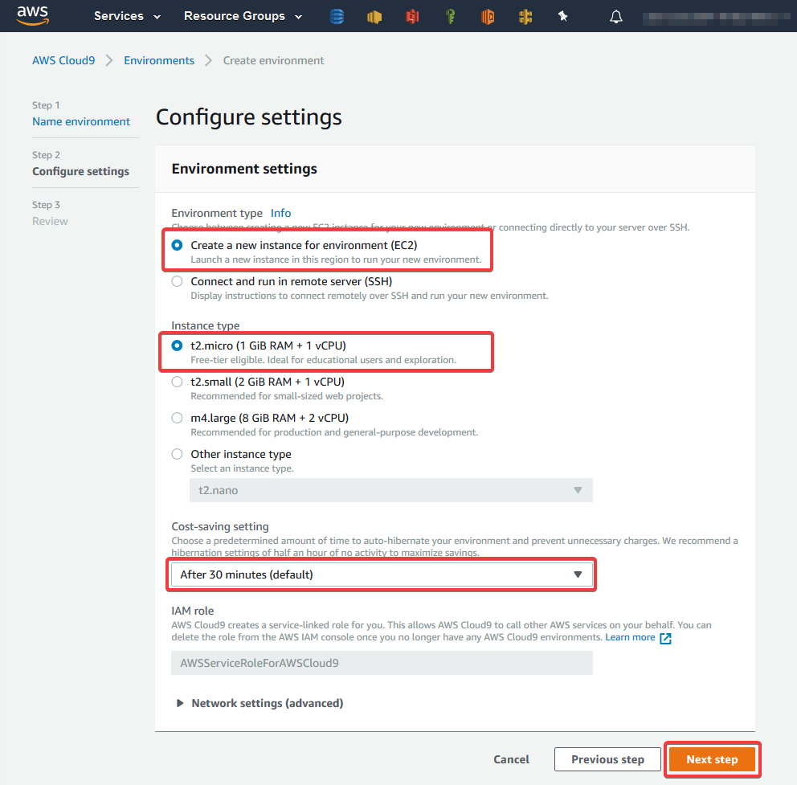
5. Cloud9 최종 점검을 합니다. 모든 검수가 완료되면 **Create environment**버튼을 클릭합니다.
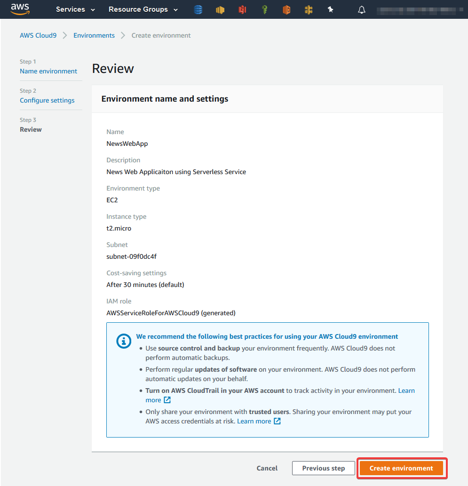
6. Cloud9 IDE가 준비중인 것을 확인할 수 있습니다. 몇 분이 지나면 IDE가 활성화 됩니다.
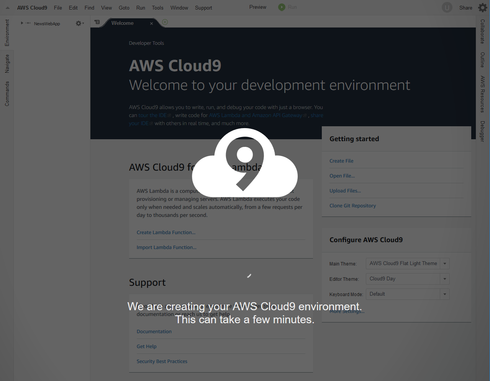
7. Cloud9에서 IDE에 대해서 환경 설정을 할 수 있습니다. 화면과 같이 **서비스 배포를 위한 리전을 별도로 지정**할 수 있습니다. 여기서는  *Singapore*리전을 그대로 사용합니다.
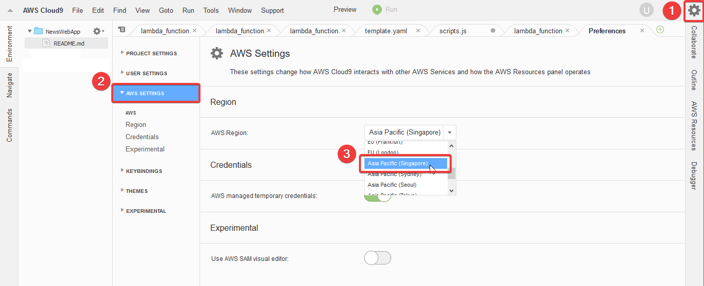
8. 개발 환경을 설치하였고, 서버리스 애플리케이션 개발을 할 준비가 완료되었습니다

#### 2. Application 및 "PostNews" Lambda 함수 생성
1. 새로운 애플리케이션 및 람다 함수를 생성합니다. Cloud9 IDE 우측 네비게이션의  **AWS Resources** 탭을 클릭하고,  **Lambda 아이콘** 을 클릭하면 새로운 함수를 생성할 수 있습니다. 이 실습에서는 총 4개의 Lambda 함수를 만들 것이기 때문에, 앞으로 추가할 나머지 3개의 함수도 동일한 방법으로 생성할 예정입니다.

2. 화면 중앙에 팝업 창이 표시됩니다. 하단의 Application name에는 **WebApp**을 상단의 Function name에는  **PostNews** 를 입력하고,  **Next** 버튼을 클릭합니다. 앞으로 추가할 나머지 3개의 함수도 Application name은 동일하게  **WebApp** 을 사용합니다.
 
3. Runtime은  **Python 2.7**을 선택하고, 하단의 Select blueprint는  **hello-world-python**을 선택하고,  **Next** 버튼을 클릭합니다.
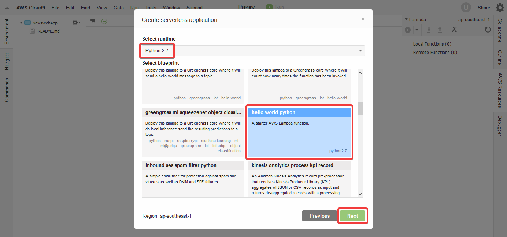 
4. PostNews 함수를 호출하는 주체는 **API Gateway**입니다. 따라서, Function trigger는 **API Gateway**를 선택합니다. API 호출에 사용할 리소스 경로는  **/news** 를 입력합니다. API 호출을 위한 보안 메커니즘은  **NONE** 으로 선택하고,  **Next** 버튼을 클릭합니다.
 
5. PostNews 함수를 실행하는 Memory는  **128MB** 로 지정합니다. Role은  **Automatically generate role** 을 선택하고, Next 버튼을 클릭합니다. Role에 들어갈 정책(Policy)는 SAM 템플릿에서 직접 설정할 예정입니다. 
 
6. PostNews 함수 구성을 확인합니다. 별도의 이상이 없을 경우,  **Finish**  버튼을 클릭 합니다.
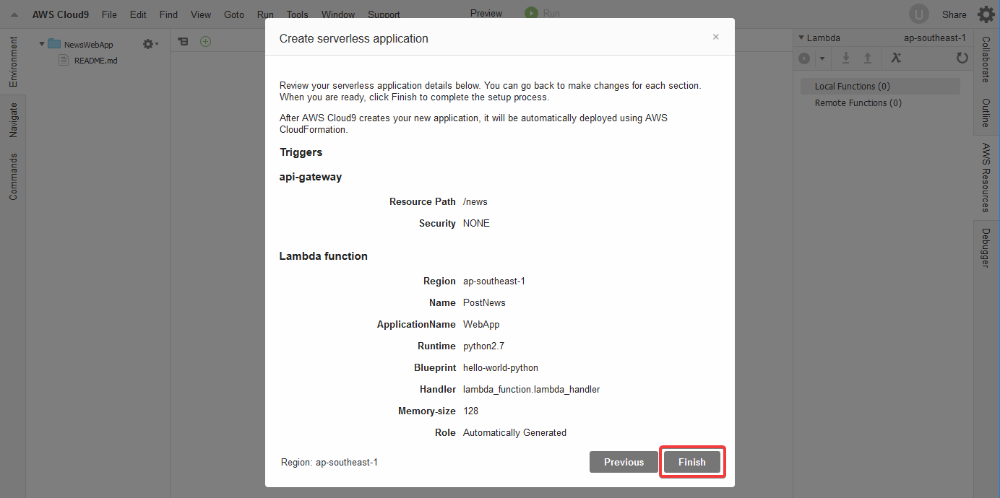 
7. 다음과 같이 Application과 Function이 세팅되는 것을 확인할 수 있습니다.

    1. 좌측 Environment 탭에  **WebApp**  Application 폴더를 생성합니다. 그리고  **PostNews** 함수에서 사용하는 폴더를 생성합니다.
    2. SAM 템플릿 파일인  **template.yaml** 파일이 생성되는것을 확인할 수 있습니다.
    3. Lambda 함수가 blueprint에 의해서 자동으로 만들어집니다. 해당 코드는 아래에서 제공하는 PostNews 함수 코드로 대체합니다.
    4. 우측 AWS Resources 탭에 Local Functions에 현재 작업중인  **WebApp** 폴더와 Application과  **PostNews** 함수를 생성하는 것을 확인할 수 있습니다.
    5. 자동으로 template을 기반으로 Lambda 서비스에 배포할 수 있습니다. 배포할 경우, 이름은  **Cloud9-** 접두사와 Application 이름인  **WebApp-** 이 접두사로 붙는 것을 확인할 수 있습니다.
8. PostNews 함수는 아래에서 제공하는 **코드로 대체**하고  <font color="red">**Ctrl+S를 눌러서 저장**</font>합니다. 코드에 대한 설명은 주석을 참조하십시오.
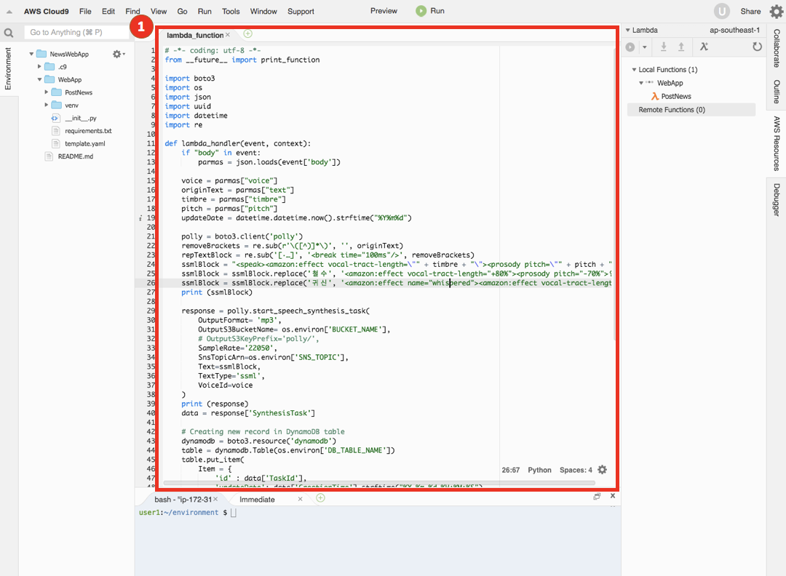
**PostNews**
    ```python 
    # -*- coding: utf-8 -*-
    from __future__ import print_function
    
    import boto3
    import os
    import json
    import uuid
    import datetime
    import re
    
    def lambda_handler(event, context):
        if "body" in event:
            parmas = json.loads(event['body'])
        
        voice = parmas["voice"]
        originText = parmas["text"]
        timbre = parmas["timbre"]
        pitch = parmas["pitch"]
        updateDate = datetime.datetime.now().strftime("%Y%m%d")
    
        polly = boto3.client('polly')
        removeBrackets = re.sub(r'\([^)]*\)', '', originText)
        repTextBlock = re.sub('[·…]', '<break time="100ms"/>', removeBrackets)
        ssmlBlock = "<speak><amazon:effect vocal-tract-length=\"" + timbre + "\"><prosody pitch=\"" + pitch + "\">" + repTextBlock + "</prosody></amazon:effect></speak>"
        ssmlBlock = ssmlBlock.replace('철수', '<amazon:effect vocal-tract-length="+80%"><prosody pitch="-70%">안녕하세요? 저는 서연 친구 철수에요.</prosody></amazon:effect>')
        ssmlBlock = ssmlBlock.replace('귀신', '<amazon:effect name="whispered"><amazon:effect vocal-tract-length="-30%"><prosody volume="loud">나 꿍꼬또, 기싱꿍꼬또</prosody></amazon:effect></amazon:effect>')
        print (ssmlBlock)
        
        response = polly.start_speech_synthesis_task(
            OutputFormat= 'mp3',
            OutputS3BucketName= os.environ['BUCKET_NAME'],
            # OutputS3KeyPrefix='polly/',
            SampleRate='22050',
            SnsTopicArn=os.environ['SNS_TOPIC'],
            Text=ssmlBlock,
            TextType='ssml',
            VoiceId=voice
        )
        print (response)
        data = response['SynthesisTask']
        
        # Creating new record in DynamoDB table
        dynamodb = boto3.resource('dynamodb')
        table = dynamodb.Table(os.environ['DB_TABLE_NAME'])
        table.put_item(
            Item = {
                'id' : data['TaskId'],
                'updateDate': data['CreationTime'].strftime("%Y-%m-%d %H:%M:%S"),
                'voice' : voice,
                'originText': originText,
                'pollyStatus' : data['TaskStatus'],
                'timbre': timbre,
                'pitch': pitch,
                'mp3Url': data['OutputUri'],
                'RequestCharacters': data['RequestCharacters']
            }
        )
        
        result = {
            'statusCode': 200,
            'body': json.dumps({'recordId': data['TaskId']}),
            'headers': {
                'Content-Type': 'application/json',
                'Access-Control-Allow-Origin': '*'
            }
        }
        
        return result

    ```

9. 이번에는 SAM Template을 변경합니다. 먼저 좌측 소스코드 영역에서  template.yaml 파일을 더블클릭하여 편집 창을 열어 줍니다. 아래와 같이 자동으로 생성되어 있는 SAM 템플릿 코드를 볼 수 있습니다. 이 실습에서는 자동으로 생성된 SAM 템플릿을 사용하지 않고 SAM 템플릿을 교체합니다.
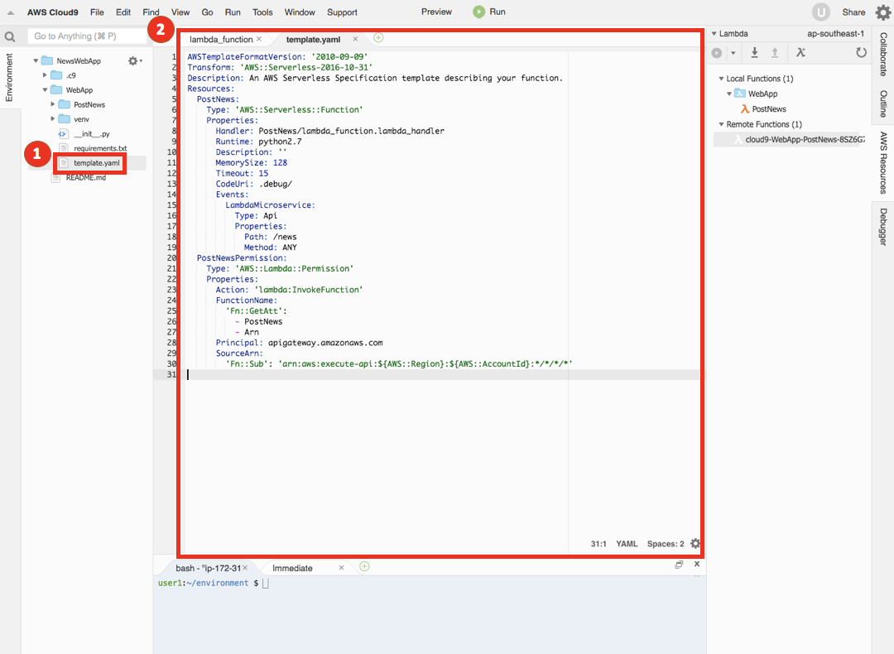

10. 아래의 SAM 템플릿 코드로 교체하고,  <font color="red">**Ctrl+S를 눌러서 저장 합니다.**</font>

    **PostNewsTemplate_01**
    ``` yaml
    AWSTemplateFormatVersion: '2010-09-09'
    Transform: 'AWS::Serverless-2016-10-31'
    Description: >-
      Building Serverless development environment and CI/CD process for DevOps based on Cloud9

    Globals:

      Function:
        Runtime: python2.7
        Handler: lambda_function.lambda_handler
        MemorySize: 128
        Timeout: 60

    Resources:

      PostNews:
        Type: 'AWS::Serverless::Function'
        Properties:
          CodeUri: PostNews
          Description: Post news text to convert from text to speech
          Tracing: Active
          Events:
            PostNewsApi:
              Type: Api
              Properties:
                Path: /news
                Method: POST
          Policies:
            - Version: '2012-10-17'
              Statement:
                - Effect: Allow
                  Action:
                    - 'logs:PutLogEvents'
                    - 'logs:CreateLogStream'
                    - 's3:PutObject'
                    - 'sns:Publish'
                    - 'dynamodb:PutItem'
                    - 'polly:StartSpeechSynthesisTask'
                  Resource: '*'
    ```
위에 기술되어진 SAM 템플릿에 대한 설명은 다음과 같습니다. 추후 이어지는 SAM도 유사하게 해석할 수 있습니다. 

> ⓘ해당 템플릿은 SAM(Serverless Architecture Model)을 기반으로 한 템플릿입니다.
> 
> Globals를 통해서 리소스에서 공통으로 사용하는 값을 사전에 정의할 수 있습니다.
>여기서는 Function, 즉 Lambda 함수에 대해서 모두 자동으로 다음과 같은 값이 적용됩니다.
>런타임은 Python2.7 기반이며, lambda_function 파일에 있는 lambda_hanlder 함수를 시작함수로 지정합니다. 메모리 사이즈는 128MB이며 Lambda가 실행되는 시간은 최대 60초입니다.
>
>리소스를 정의하는 단계에서는 먼저 리소스에 대한 이름을 쓰고 리소스가 가진 서비스 타입을 명시합니다.
>PostNews라는 리소스를 만들 것이고, AWS:Serverless:Function 타입이므로 Lambda 함수를 의미합니다.
>이 함수가 가지는 속성 값으로는 Globals에서 상속 받는 런타임, 핸들러, 메모리사이즈, 실행시간이 있습니다.
>CodeUri는 소스코드가 위치한 폴더를 지칭합니다. 해당 Lambda 함수가 PostNews 폴더에 있다는 것을 의미합니다.
>
>해당 Lambda 함수를 동작시키는 이벤트 트리거의 이름은 PostNewsApi 입니다.
>이 리소스의 서비스 타입은 API이므로 API Gateway가 됩니다.
API Gateway가 가지는 속성 값으로 리소스에 대한 경로는 /news를 사용합니다.
>그리고 News를 등록하는 작업이기 때문에 HTTP Method는 POST를 사용합니다.
>
>해당 Lambda 함수가 실행하는 동안 접근해야할 리소스에 대한 권한을 설정할 수 있습니다. 이를 정책으로 정의할 수 있습니다.
>정책은 CloudWatch Logs에 코드에서 발생한 로그를 기록할 수 있는 정책을 추가합니다.
>또한 DynamoDB 테이블에 값을 추가할 수 있는 정책과 비동기 처리를 위해서 Polly에 Task를 등록하고, Polly가 MP3 파일을 업로드 하고, 작업 완료 후, SNS을 게시할 수 있는 권한을 부여합니다.

11. 변경하여 수정한 SAM 템플릿 구성은 다음과 같습니다. 각 구성에 대해서 다시 한 번 자세히 살펴보면 아래와 같습니다.
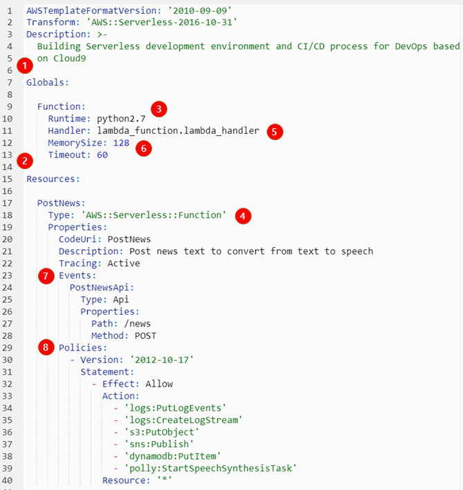
    1. Globals 는 전역으로 사용합니다. 함수(Function)나 API에서 반복해서 사용하는 것을 선언할 수 있습니다.
    2. Resources 는 AWS 서비스를 정의합니다. 각 서비스에 대해서 이름을 선언하고, Type을 정할 수 있습니다.
    3. Runtime 은 Function에서 사용합니다. 4개의 Lambda 함수가 모두 Python 2.7 기반이기 때문에  python2.7 을 선언합니다.
    4. Type 은 서비스 타입을 의미합니다. Lambda 함수, API Gateway, DynamoDB, SNS, S3 등을 표기할 수 있습니다.
    5. CodeUri 는 Lambda 함수가 위치한 폴더를 의미합니다. template.yaml 파일 기준으로 Lambda 함수가 있는 폴더의 이름을 지정합니다.
    6. Handler 는 Lambda 함수가 시작하는 함수의  파일명.함수명 에 대한 구성을 의미 합니다. 모두  lambda_function.py 파일에 선언되어 있는  lambda_handler 함수가 시작 함수가 됩니다. 각각의 함수는 폴더가 서로 다릅니다.
    7. MemorySize 는  128MB 로 모두 구성되어 있으며, Lambda 함수의 최대 구동 시간은  Timeout 값을 사용하고  60 초로 설정합니다.
    8. Events 는 Lambda 함수를 트리거하는 이벤트를 의미합니다.  API Gateway 일 경우  Type  은  Api 가 됩니다. SNS에 의해서 트리거 될 경우, Type은 Sns가 됩니다.
    9. Policies 는 해당 함수가 접근할 수 있는 서비스에 대한 권한을 줄 수 있습니다. 각각의 함수는 최소 권한의 원칙에 의거하여 필요한 정책만을 연결합니다.
    10. PostNews 함수는 동작 로그를 남기기 위해서  logs:PutLogEvents 와 logs:CreateLogStream 을, DynamoDB에 항목을 추가하기 위해서  dynamodb:PutItem  이 필요합니다. 또한 Polly를 통해서 TTS 서비스 작업을 비동기적으로 처리하기 위해서  polly:StartSpeechSynthesisTask 가 필요하고, MP3를 업로드 하기 위한 권한  s3:PutObject 과 Polly 작업 완료시 SNS Topic에 게시하기 위해서  sns:Publish  를 설정합니다.
12. SAM 설정이 완료되면 해당 template.yaml 파일을 Cloud9에서 바로 배포할 수 있습니다.
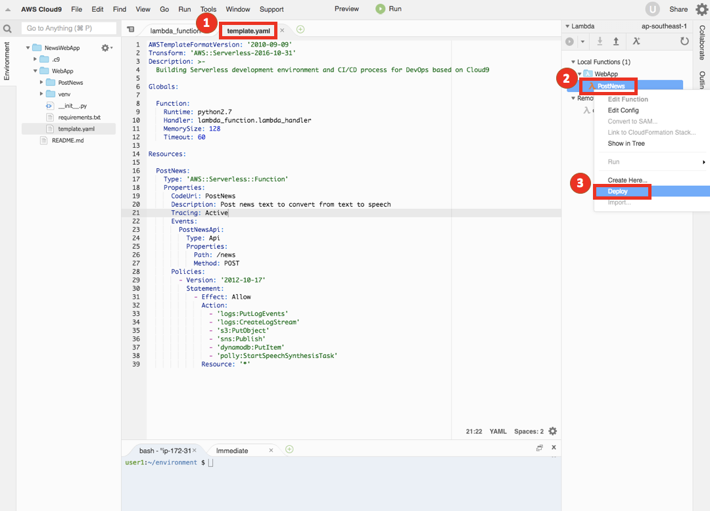
    1. 우측의 해당 Lambda 함수에서 마우스 우측 버튼을 클릭하고  Deploy 명령을 수행 합니다. 해당 SAM 템플릿이 CloudFormation Stack에 업데이트 되는 것을 확인할 수 있습니다. 서비스에서  CloudFormation  서비스로 이동하면  cloud9-WebApp 이 추가되어 있는 것을 확인할 수 있습니다. 해당 Stack을 클릭하면 배포된 리소스를 알 수 있습니다. 다음 서버리스 리소스 추가 부분에서 CloudFormation에 추가된 템플릿을 확인하겠습니다.
#### 3. SAM 기반 서버리스 리소스 추가 ####
1. SAM 템플릿을 이용해서 S3 Bucket, SNS, DynamoDB 테이블을 배포할 수 있습니다. 다음과 같이 template.yaml 파일에 리소스에 추가합니다
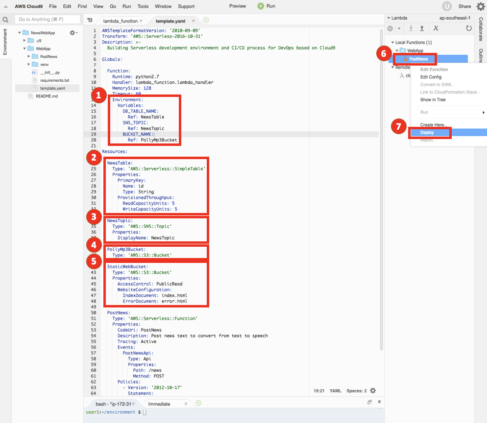
    1. **Environment**: 환경 변수를 선언합니다. 각각의 Lambda 함수에는 DynamoDB, SNS, S3 버킷에 접근하기 위해서 ARN이 필요합니다. SAM에서 자동으로 만들어준 각각의 리소스 ARN을 참조할 수 있도록 설정합니다.
    2. **NewsTable**: SAM에서 SimpleTable은 DynamoDB를 의미합니다. 여기서 DynamoDB를 기본 세팅인 WCU 5, RCU 5 값으로 생성합니다.
    3. **NewsTopic**: PostNews에 들어온 텍스트 값은 비동기적으로 처리를 위하여 ConvertAudio 함수의 처리를 필요로 합니다. ConvertAudio의 처리를 위해서 사용할 SNS Topic을 하나 생성합니다.
    4. **PollyMp3Bucket**: Amazon Polly를 이용해서 생성한 MP3 파일을 저장할 S3 버킷을 생성합니다.
    5. **StaticWebBucket**: S3는 객체 스토리지이면서 정적 웹 호스팅을 위한 서비스로 활용할 수 있습니다. 여기서는 정적 웹 호스팅을 위한 설정까지 함께 구성하여 SAM에 서비스를 추가합니다.
    6. 변경된 SAM 템플릿을 반영하기 위해서 우측 Lambda 함수에서 마우스 우측 버튼을 클릭하고 Deploy 명령을 수행합니다.

    **PostNewsTemplate_02**
    ``` yaml
    AWSTemplateFormatVersion: '2010-09-09'
    Transform: 'AWS::Serverless-2016-10-31'
    Description: >-
      Building Serverless development environment and CI/CD process for DevOps based on Cloud9

    Globals:

      Function:
        Runtime: python2.7
        Handler: lambda_function.lambda_handler
        MemorySize: 128
        Timeout: 60
        Environment:
          Variables:
            DB_TABLE_NAME:
              Ref: NewsTable
            SNS_TOPIC:
              Ref: NewsTopic
            BUCKET_NAME:
              Ref: PollyMp3Bucket

    Resources:

      NewsTable:
        Type: 'AWS::Serverless::SimpleTable'
        Properties:
          PrimaryKey:
            Name: id
            Type: String
          ProvisionedThroughput:
            ReadCapacityUnits: 5
            WriteCapacityUnits: 5

      NewsTopic:
        Type: 'AWS::SNS::Topic'
        Properties:
          DisplayName: NewsTopic

      PollyMp3Bucket:
        Type: 'AWS::S3::Bucket'

      StaticWebBucket:
        Type: 'AWS::S3::Bucket'
        Properties:
          AccessControl: PublicRead
          WebsiteConfiguration:
            IndexDocument: index.html
            ErrorDocument: error.html

      PostNews:
        Type: 'AWS::Serverless::Function'
        Properties:
          CodeUri: PostNews
          Description: Post news text to convert from text to speech
          Tracing: Active
          Events:
            PostNewsApi:
              Type: Api
              Properties:
                Path: /news
                Method: POST
          Policies:
            - Version: '2012-10-17'
              Statement:
                - Effect: Allow
                  Action:
                    - 'logs:PutLogEvents'
                    - 'logs:CreateLogStream'
                    - 's3:PutObject'
                    - 'sns:Publish'
                    - 'dynamodb:PutItem'
                    - 'polly:StartSpeechSynthesisTask'
                  Resource: '*'
    ```
2. AWS 관리 콘솔에서 CloudFormation 서비스로 이동하면 다음과 같이 Stack을 확인할 수 있습니다.

   1. Cloud9 환경을 배포했기 때문에 해당 Stack( aws-cloud9-NewsWebApp-xxxxxxxxxx )이 등록되어 있는 것을 확인할 수 있습니다.
   2. Cloud9 환경에서 만든 WebApp이 배포된  Cloud9-WebApp  Stack을 확인할 수 있습니다.
3. 아래와 같이 Cloud9에서 SAM template을 변경하고 Delpoy 하면, 해당 Stack이 업데이트 되는 것을 확인할 수 있습니다.

4. **Cloud9-WebApp** 을 클릭하고 들어가면, Stack에 대해서 자세히 확인할 수 있습니다. 현재 추가로 배포한 리소스가 배포 완료된 것을 확인할 수 있습니다.
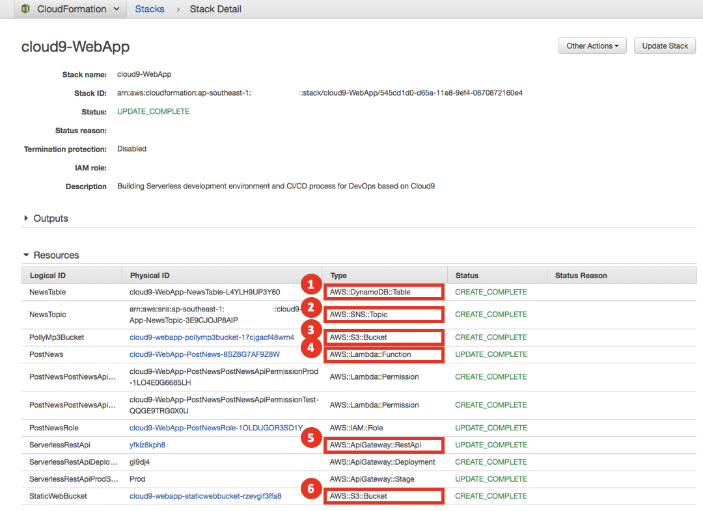
#### 4. "UpdateNews" Lambda 함수 생성 ####
1. *새로운 함수를 생성하기 전에, 화면에 열려 있는 파일   <font color="red">template.yaml 파일을 반드시 닫습니다.</font> (파일을 닫지 않고 생성할 경우, 자동으로 template에 리소스가 추가되지 않습니다. 직접 추가해도 무방합니다.)*
2. 우측 AWS Resources 탭에 있는 Lambda 아이콘을 클릭하여 두 번째 함수인 **UpdateNews** 함수를 생성합니다. Application name은  **WebApp**이고, Function name은  **UpdateNews** 를 입력하고 우측 하단의  **Next** 버튼을 클릭합니다. **(2.2 참고)**
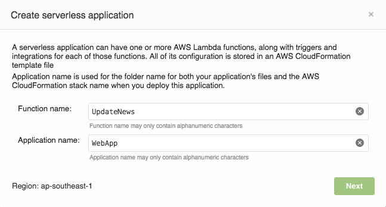
3. Runtime은  Python2.7 을 선택하고 blueprint는  hello-world-python 을 선택하고,  Next 버튼을 클릭합니다. **(2.3 참고)**
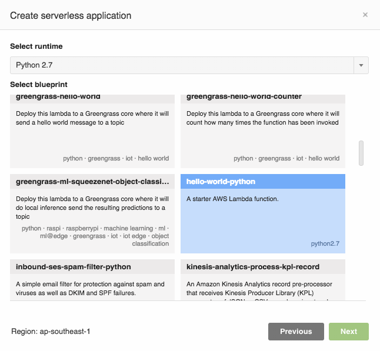
4. **UpdateNews** 함수는 SNS에 의하여 trigger됩니다. SAM 을 통해서 등록할 예정이므로, **Function trigger**는  **none** 으로 설정합니다.

5. **UpdateNews** 함수를 실행하는 Memory는 **128MB**로 지정합니다. Role은 **Automatically generate role**을 선택하고, Next 버튼을 클릭합니다. Role에 들어갈 정책(Policy)는 SAM 템플릿에서 직접 설정할 예정입니다. 
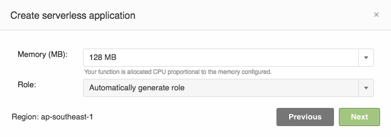
6. **UpdateNews** 함수 구성을 확인합니다. 별도의 이상이 없을 경우, **Finish**  버튼을 클릭 합니다.
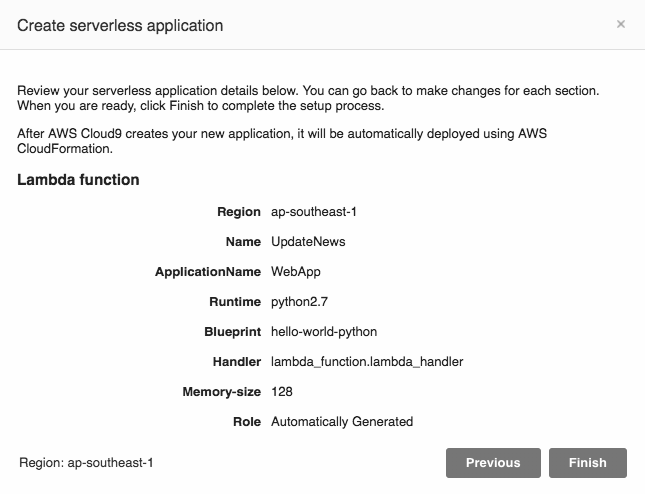
7. **UpdateNews** 함수 코드를 다음과 같이 변경하고 저장합니다. Amazon Polly로부터 작업이 완료되면, DynamoDB에 해당 작업을 업데이트 하고, Polly가 S3에 업로드한 MP3에 접근할 수 있도록 Public-read 권한을 부여합니다. 
**UpdateNews**
    ``` python
    from __future__ import print_function
    
    import boto3
    import os
    import json
    from contextlib import closing
    from boto3.dynamodb.conditions import Key, Attr
    import re
    
    def lambda_handler(event, context):
        polly_message = event["Records"][0]["Sns"]["Message"]
        print (polly_message)
        polly_response = json.loads(polly_message)
    
        # Updating the item in DynamoDB
        dynamodb = boto3.resource('dynamodb')
        table = dynamodb.Table(os.environ['DB_TABLE_NAME'])
    
        response = table.update_item(
            Key={
                'id': polly_response["taskId"]
            },
            UpdateExpression="set pollyStatus = :s",
            ExpressionAttributeValues={
                ':s': polly_response['taskStatus']
            }
        )
        
        print(response)
        
        s3 = boto3.client('s3')
        s3.put_object_acl(
            ACL = 'public-read',
            Bucket = os.environ['BUCKET_NAME'],
            Key = polly_response["taskId"] + ".mp3"
        )
        
        return
    ```
8. 사전에 닫힌 template.yaml 파일을 클릭하여 열고,  UpdateNews  함수 설정이 추가되는 것을 확인합니다. 그리고, 아래의 SAM 코드로 대체하고 Deploy를 진행합니다.
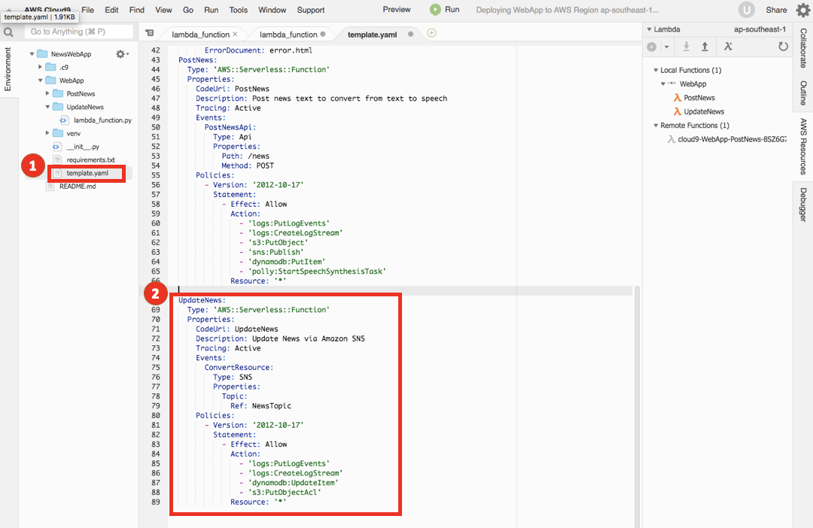
**CoverAudio Template**
    ``` yaml
    Resources:
    ...
      UpdateNews:
        Type: 'AWS::Serverless::Function'
        Properties:
          CodeUri: UpdateNews
          Description: Update News via Amazon SNS
          Tracing: Active
          Events:
            ConvertResource:
              Type: SNS
              Properties:
                Topic:
                  Ref: NewsTopic
          Policies:
            - Version: '2012-10-17'
              Statement:
                - Effect: Allow
                  Action:
                    - 'logs:PutLogEvents'
                    - 'logs:CreateLogStream'
                    - 'dynamodb:UpdateItem'
                    - 's3:PutObjectAcl'
                  Resource: '*'
    ````
#### 5."GetNews" Lambda 함수 생성 ####
1. 먼저 화면에 열려 있는 template.yaml 파일을 닫고, PostNews와 UpdateNews 함수처럼 **GetNews** 함수를 생성합니다.

2. 코드는 다음을 참고합니다. 해당 함수는 DynamoDB에서 데이터를 가져오는 로직이 들어 있습니다. 코드 12번째 라인에 x자 표시가 나타나지만 무시하셔도 됩니다.

**GetNews**
    ``` python
    from __future__ import print_function
    
    import boto3
    import os
    import json
    import decimal
    from boto3.dynamodb.conditions import Key, Attr
    
    # https://docs.aws.amazon.com/ko_kr/amazondynamodb/latest/developerguide/GettingStarted.Python.04.html
    # Helper class to convert a DynamoDB item to JSON.
    class DecimalEncoder(json.JSONEncoder):
        def default(self, o):
            if isinstance(o, decimal.Decimal):
                if o % 1 > 0:
                    return float(o)
                else:
                    return int(o)
            return super(DecimalEncoder, self).default(o)
    
    def lambda_handler(event, context):
        if "queryStringParameters" in event:
            parmas = event['queryStringParameters']
        print (parmas)
        
        postId = parmas["postId"]
        dynamodb = boto3.resource('dynamodb')
        table = dynamodb.Table(os.environ['DB_TABLE_NAME'])
    
        if postId == "*":
            items = table.scan()
        else:
            items = table.query(KeyConditionExpression=Key('id').eq(postId))
            
        response = {
            'statusCode': 200,
            'body': json.dumps(items["Items"], cls=DecimalEncoder),
            'headers': {
                'Content-Type': 'application/json',
                'Access-Control-Allow-Origin': '*'
            }
        }
    
        return response
    ```
3. SAM 템플릿을  GetNews  함수에 맞게 기존 설정을 지우고 아래와 같이 추가하고 저장한 후, Deploy를 수행합니다.
   
    **GetNews Template**
    ``` yaml
    Resources:
    ...
      GetNews:
        Type: 'AWS::Serverless::Function'
        Properties:
          CodeUri: GetNews
          Description: Gather information from Ajax calls from web pages
          Tracing: Active
          Events:
            GetNewsApi:
              Type: Api
              Properties:
                Path: /news
                Method: GET
          Policies:
            - Version: '2012-10-17'
              Statement:
                - Effect: Allow
                  Action:
                    - 'logs:PutLogEvents'
                    - 'logs:CreateLogStream'
                    - 'dynamodb:Query'
                    - 'dynamodb:Scan'
                  Resource: '*'
    ```
#### 6. "DeleteNews" Lambda 함수 생성 ####
1. template.yaml 파일을 닫고, 마지막으로 **DeleteNews** 함수를 생성합니다.

2. 코드는 다음을 참고합니다. 해당 함수는 postId 값을 확인한 후에, dynamoDB에 등록된 정보와 생성된 MP3를 삭제하는 로직이 들어가 있습니다.

**DeleteNews**
    ``` python
    from __future__ import print_function
    
    import boto3
    import os
    import json
    from boto3.dynamodb.conditions import Key, Attr
    
    def lambda_handler(event, context):
        if "body" in event:
            params = json.loads(event['body'])
        print (params)
        
        # Bad Request
        if params["postId"] is None or params["postId"] == "":
            response = {
                'statusCode': 400,
                'body': json.dumps({'message': "An unknown error has occurred. Missing required parameters."}),
                'headers': {
                    'Content-Type': 'application/json',
                    'Access-Control-Allow-Origin': '*'
                }
            }
            return response
        
        postId = params["postId"]
        dynamodb = boto3.resource('dynamodb')
        table = dynamodb.Table(os.environ['DB_TABLE_NAME'])
        table.delete_item(Key={"id":postId})
        
        s3 = boto3.client('s3')
        s3.delete_object(Bucket=os.environ['BUCKET_NAME'], Key= postId + ".mp3")
    
        response = {
            'statusCode': 200,
            'body': json.dumps({'message': "item is deleted : " + postId}),
            'headers': {
                'Content-Type': 'application/json',
                'Access-Control-Allow-Origin': '*'
            }
        }
        
        return response
    ```
3. **DeleteNews**를 위해서 SAM 템플릿을 아래와 같이 추가합니다. SAM 템플릿을 수정 저장한 후에는 **반드시 Deploy**를 해서 정상적으로 템플릿이 배포가 되었는지 확인을 합니다.

**DeleteNews Template**
    ``` yaml
    Resources:
    ...
      DeleteNews:
        Type: 'AWS::Serverless::Function'
        Properties:
          CodeUri: DeleteNews
          Description: Delete news item in DynamoDB Table and mp3 file in S3 bucket.
          Tracing: Active
          Events:
            DeleteNewsApi:
              Type: Api
              Properties:
                Path: /news
                Method: DELETE
          Policies:
            - Version: '2012-10-17'
              Statement:
                - Effect: Allow
                  Action:
                    - 'logs:PutLogEvents'
                    - 'logs:CreateLogStream'
                    - 'dynamodb:DeleteItem'
                    - 's3:DeleteObject'
                  Resource: '*'
    ```
    1. 삭제 이벤트에 대해서 DynamoDB의 항목을 삭제하기 위해서  **dynamodb:DeleteItem** 정책과 S3에 생성된 MP3 파일을 삭제하기 위해서  **s3:DeleteObject** 정책을 추가합니다.

#### 7. SAM에서의 Outputs 설정 ####
1. SAM 템플릿에서 생성된 리소스를 확인하기 위해서 CloudFormation의 Stack 상세에서 Outputs으로 출력을 만들 수 있습니다. 여기서는 3개의 출력물을 생성합니다. 

**Template_Outpuit**
    ``` yaml
    Outputs:
      S3WebBucket:
        Description: S3 Bucket Name for web hosting
        Value:
          Ref: StaticWebBucket
      WebsiteURL:
        Description: Name of S3 bucket to hold website content
        Value:
          'Fn::Join':
            - ''
            - - 'https://'
              - 'Fn::GetAtt':
                - StaticWebBucket
                - DomainName
              - '/index.html'
      APIEndpointURL:
        Description: URL of your API endpoint
        Value:
          'Fn::Sub': >-
            https://${ServerlessRestApi}.execute-api.${AWS::Region}.amazonaws.com/Prod/news
    ```
   1. **S3WebBucket**: 정적 웹 호스팅을 하는 S3 버킷 이름
   2. **WebsiteURL**: 정적 웹 호스팅에 접속하기 위한 URL 정보, 정적 웹 호스팅을 하기 위한 정적 컨텐츠 파일은 추후 업로드 합니다.(html, css, js)
   3. **APIEndpointURL**: 동적 API를 활용하기 위한 API Gateway가 배포한 Endpoint URL 정보

#### 8. SAM에서의 CORS 설정 ####
1.S3에서 제공하는 정적 웹 호스팅을 하는 버킷에서 제공하는 URL의 도메인과 API Gateway 에서 배포한 API Endpoint URL의 도메인은 서로 상이합니다. 따라서 브라우저에서 발생하는 보안 이슈를 해결하기 위해서는 CORS 설정을 해야합니다. 이 설정 역시 SAM에 모든 API Gateway에 추가할 수 있습니다. 따라서 Globals에 API 영역에 다음과 같이 추가합니다. SAM 템플릿을 수정 저장한 후에는 **반드시 Deploy**를 해서 정상적으로 템플릿이 배포가 되었는지 확인을 합니다.

**Template_API_CORS**
``` yaml
Globals:
...
  Api:
    Cors:
      AllowMethods: "'*'"
      AllowHeaders: "'*'"
      AllowOrigin: "'*'"
```
지금까지의 SAM을 정리하면 다음과 같습니다.

**Final SAM**
``` yaml
AWSTemplateFormatVersion: '2010-09-09'
Transform: 'AWS::Serverless-2016-10-31'
Description: >-
  Building Serverless development environment and CI/CD process for DevOps based on Cloud9
   
Globals:
   
  Function:
    Runtime: python2.7
    Handler: lambda_function.lambda_handler
    MemorySize: 128
    Timeout: 60
    Environment:
      Variables:
        DB_TABLE_NAME:
          Ref: NewsTable
        SNS_TOPIC:
          Ref: NewsTopic
        BUCKET_NAME:
          Ref: PollyMp3Bucket
   
  Api:
    Cors:
      AllowMethods: "'*'"
      AllowHeaders: "'*'"
      AllowOrigin: "'*'"
 
Resources:
   
  NewsTable:
    Type: 'AWS::Serverless::SimpleTable'
    Properties:
      PrimaryKey:
        Name: id
        Type: String
      ProvisionedThroughput:
        ReadCapacityUnits: 5
        WriteCapacityUnits: 5
   
  NewsTopic:
    Type: 'AWS::SNS::Topic'
    Properties:
      DisplayName: NewsTopic
   
  PollyMp3Bucket:
    Type: 'AWS::S3::Bucket'
   
  StaticWebBucket:
    Type: 'AWS::S3::Bucket'
    Properties:
      AccessControl: PublicRead
      WebsiteConfiguration:
        IndexDocument: index.html
        ErrorDocument: error.html
   
  PostNews:
    Type: 'AWS::Serverless::Function'
    Properties:
      CodeUri: PostNews
      Description: Post news text to convert from text to speech
      Tracing: Active
      Events:
        PostNewsApi:
          Type: Api
          Properties:
            Path: /news
            Method: POST
      Policies:
        - Version: '2012-10-17'
          Statement:
            - Effect: Allow
              Action:
                - 'logs:PutLogEvents'
                - 'logs:CreateLogStream'
                - 's3:PutObject'
                - 'sns:Publish'
                - 'dynamodb:PutItem'
                - 'polly:StartSpeechSynthesisTask'
              Resource: '*'
   
  UpdateNews:
    Type: 'AWS::Serverless::Function'
    Properties:
      CodeUri: UpdateNews
      Description: Update News via Amazon SNS
      Tracing: Active
      Events:
        ConvertResource:
          Type: SNS
          Properties:
            Topic:
              Ref: NewsTopic
      Policies:
        - Version: '2012-10-17'
          Statement:
            - Effect: Allow
              Action:
                - 'logs:PutLogEvents'
                - 'logs:CreateLogStream'
                - 'dynamodb:UpdateItem'
                - 's3:PutObjectAcl'
              Resource: '*'
   
  GetNews:
    Type: 'AWS::Serverless::Function'
    Properties:
      CodeUri: GetNews
      Description: Gather information from Ajax calls from web pages
      Tracing: Active
      Events:
        GetNewsApi:
          Type: Api
          Properties:
            Path: /news
            Method: GET
      Policies:
        - Version: '2012-10-17'
          Statement:
            - Effect: Allow
              Action:
                - 'logs:PutLogEvents'
                - 'logs:CreateLogStream'
                - 'dynamodb:Query'
                - 'dynamodb:Scan'
              Resource: '*'
   
  DeleteNews:
    Type: 'AWS::Serverless::Function'
    Properties:
      CodeUri: DeleteNews
      Description: Delete news item in DynamoDB Table and mp3 file in S3 bucket.
      Tracing: Active
      Events:
        DeleteNewsApi:
          Type: Api
          Properties:
            Path: /news
            Method: DELETE
      Policies:
        - Version: '2012-10-17'
          Statement:
            - Effect: Allow
              Action:
                - 'logs:PutLogEvents'
                - 'logs:CreateLogStream'
                - 'dynamodb:DeleteItem'
                - 's3:DeleteObject'
              Resource: '*'
   
Outputs:
 
  S3WebBucket:
    Description: S3 Bucket Name for web hosting
    Value:
      Ref: StaticWebBucket
   
  WebsiteURL:
    Description: Name of S3 bucket to hold website content
    Value:
      'Fn::Join':
        - ''
        - - 'https://'
          - 'Fn::GetAtt':
              - StaticWebBucket
              - DomainName
          - '/index.html'
     
  APIEndpointURL:
    Description: URL of your API endpoint
    Value:
      'Fn::Sub': >-
        https://${ServerlessRestApi}.execute-api.${AWS::Region}.amazonaws.com/Prod/news
```
#### 9. 정적 웹 호스팅을 위한 파일 업로드하기 ####
1. 다음과 같이 정적 컨텐츠 파일을 다운로드 받습니다. Scripts.js 파일에 API Endpoint URL을 넣어주고, S3 버킷에 업로드 합니다. 순서는 아래와 같이 수행합니다.

5번의 API_ENDPOINT는 하단의 CloudFormation 스택에서 확인 할 수 있습니다.
2. 정적 웹 호스팅 파일 다운로드 받기 (Command Line Interface)
    ``` sh
    wget http://polly.awsdemokr.com/301_static_web.zip
    ```
3. 압축 풀고 폴더 이동 (Command Line Interface)
    ``` sh
    unzip 301_static_web.zip
    cd 301_static_web
    ```
4. Cloud9에서 scripts.js 파일을 열고, CloudFormation Stack에 배포된 Output의  **APIEndpointURL** 값을  **scripts.js** 소스코드 첫 줄의  **API_ENDPOINT**에 반영 (WebsiteURL이 아니므로 주의)
   
    CloudFormation에 접속해서 Cloud9-WebApp 스택을 클릭합니다.
    

    스택 상세 하단에 Outputs에 있는 리소스 2개(APIEndPointURL, S3WebBucket)를 확인합니다. 
    

5. Cloud9에서 다운 받아서 압축을 해제한 scripts.js 파일을 열고 첫 줄을 수정하고 저장합니다.
    ``` javascript
    var API_ENDPOINT = "https://xxxxxxxxxx.execute-api.ap-southeast-1.amazonaws.com/Prod/news/";
    if (API_ENDPOINT === "")
    {
            alert("scripts.js 파일의 상단에 API Gateway에 배포한 URL을 등록하고 실행하세요.");
    }
    ```
6. 정적 웹 포스팅하고자 하는 S3 버킷에 public-read 권한으로 파일을 업로드 (CloudFormation Stack에 배포된 Output의  **S3WebBucket** 값을 아래에 대체)
    ``` sh
    aws s3 sync . s3://cloud9-webapp-staticwebbucket-xxxxxxxxxxxx --acl public-read
    ```
7. 웹 브라우저로 정적 웹 페이지에 접속합니다. CloudFormation Stack에 배포된 Output의 WebsiteURL 값을 클릭하면 바로 접속할 수 있습니다. 하단의 URL에 대한 형태를 기술해 놓았습니다.
    1. <https://cloud9-webapp-staticwebbucket-xxxxxxxxxxxx.s3.amazonaws.com/index.html>
   
#### 10. 서비스 동작 테스트 ####
1. **Chrome 웹 브라우저**를 통해서 CloudFormation의 Stack에서 제공하는 **WebsiteURL**로 접속합니다. 아래와 같은 사이트가 S3를 통해서 웹 호스팅 되는 것을 확인합니다. (Firefox에서는 해당 플러그인 설치 후 Enable 하여야 사용 가능합니다..)
   
   1. PostNews를 호출하기 위해서 음성으로 변환하고자 하는 텍스트를 입력합니다.
       ```
       안녕하세요. 서연입니다. 철수. 귀신.
       ```
   2. 음성 변환 시작 버튼을 클릭하여 텍스트를 음성으로 변환합니다.
   3. 최초 Polly 작업을 요청한 상태는 scheduled  상태입니다.
2. 시간이 지나면, 아래와 같이 상태가 COMPLETED 로 변경되는 것을 확인할 수 있습니다. MP3를 재생해 봅니다.

   1. 아래 검색 버튼을 클릭하면 변환되는 Text를 음성으로 변경한 정보를 확인할 수 있습니다. MP3가 제작 되기 전이라면, 다시 한 번 검색 버튼을 클릭합니다.
   2. 새롭게 만들어진 ID를 확인할 수 있습니다. 게시물 검색은 해당 ID를 이용할 수 있습니다. ElasticSearch를 이용하면, Text와 ID 정보를 등록하고 검색할 수 있게 서비스를 구축할 수 있습니다.
3. 옵션을 조정해서 MP3를 만들 수 있습니다. 아래와 같이 정치적 기사는 SSML 옵션으로 음색과 음높이를 조절하여 텍스트에 적합한 목소리 형태로 변경할 수 있습니다. ConvertAudio 함수에 SSML 태그로 이루어진 것을 확인할 수 있습니다.

   1. 생성된 MP3를 재생하면서 옵션 변화에 따른 음성 변화를 확인할 수 있습니다.

#### 11. SAM을 이용한 새로운 스택에 직접 배포 ####
1. SAM은 코드 기반의 AWS의 서버리스 클라우드 인프라에 대한 템플릿을 생성한 결과물입니다. 즉, 해당 SAM을 이용하면 서비스 배포를 할 수 있습니다. 이 작업은 Command Line Interface에서 진행하겠습니다.

2. 먼저 SAM 템플릿 배포를 위해서 S3 버킷을 하나 생성(예:  ***template-deploy-301***  <font color="red">**이름을 변경**</font> )합니다. 해당 S3 버킷에 패키지를 업로드 합니다. 
    ``` sh
    aws s3 mb s3://template-deploy-301
    ```
3. Cloud9 IDE 하단의  **~/ environment**  디렉토리에서 하단의 작업을 진행할 수 있습니다.
    ``` sh
    sam package --template-file WebApp/template.yaml --output-template-file webapp-output.yaml --s3-bucket template-deploy-301
    ```
    template-depoly-301 버킷에는 배포에 필요한 아티팩트가 들어가 있습니다. 각 람다 함수별로 패키징된 임의의 파일들이 생성되는 것을 확인할 수 있습니다.
    각각의 파일은 ZIP 파일로 바로 Lambda 함수에 배포할 수 있는 코드의 묶음입니다. 직접 다운로드 해서 unzip을 하면 확인할 수 있습니다.

4. 다음과 같이  **WebAppTest**라는 새로운 스택으로 배포를 진행할 수 있습니다.  **webapp-outpuy.yaml**파일에는 Function의 CodeUri가 S3로 변경되어져 있는 것을 확인할 수 있습니다.
    ``` sh
    sam deploy --template-file /home/ec2-user/environment/webapp-output.yaml --stack-name WebAppTest --capabilities CAPABILITY_IAM
    ```
5. CloudFormation의 WebAppTest Stack으로 이동하여 정상 배포가 되는 것을 확인합니다.

6. 이를 통해서 SAM을 재사용하는 방법과 서버리스 서비스를 CICD로 배포하기 위해 필요한 SAM 템플릿을 만드는 방법을 알아 보았습니다.
7. **Lambda** 서비스로 이동하면, **Applications**에서 각각의 SAM 별로 리소스가 통합되어 관리가 되는 것을 확인할 수 있습니다.
8. 해당 Lambda 함수의 실제 호출 시간을 모니터링 하기 위해서 SAM에 Tracing: Active 가 들어 있습니다. X-ray 서비스로 이동하여 서비스를 사용한 이력을 확인해 보세요.


#### 12. 실습 자료 삭제 ####
1. CloudFormation에서 배포되어 있는 Stack을 삭제합니다.
   1. 11번에서 수동 배포한 Stack: WebAppTest
   2. Cloud9 IDE에서 배포한 Stack: Cloud9-WebApp (만약 S3 버킷에 파일이 있을 경우, 삭제가 실패될 수 있습니다. S3 버킷을 Empty하시고 다시 삭제를 시도합니다.)
   3. Cloud9 서비스로 이동한 후 해당 Cloud9을 삭제합니다.: aws-cloud9-NewWepApp 
2. 삭제시 S3 버킷에 파일이 있을 경우, 삭제가 안될 수 있습니다. 관리 콘솔에서 S3 서비스로 이동한 다음 관련 버킷을 직접 삭제하시면 됩니다.

### Lab2. CodeStar를 이용한 서버리스 서비스 CICD 배포 프로세스 이해 ### 
Lab1에서 SAM을 구성하는 방법을 배웠습니다. Lab2에서는 서버리스 서비스의 CICD 배포 프로세스를 이해하는 실습입니다. CodeStar를 이용하여 서버리스 서비스를 하나 배포합니다. CodeStar는 소스 리포지토리인 CodeCommit, 소스를 빌드하고 단위테스트를 지원하는 CodeBuild, 서버리스 서비스를 배포하기 위한 CloudFormation을 지원하고 있으며, SAM에서 CodeDeploy 를 지원하기 위해서 SAM 안에 간단한 설정만으로 Canary 배포 환경을 구축할 수 있습니다. CodeStar는 위에서 언급한 Code 시리즈 서비스를 CodePipeline에 의해서 하나의 CI/CD 배포 프로세스를 자동으로 구성합니다. IDE는 Cloud9을 선택할 수 있으며, Cloud9이 배포가 완료되면 자동으로 CodeCommit에 배포된 blueprint가 clone 되는 것을 스크립트로 확인할 수 있습니다.

Lab2에서는 서버리스 서비스의 CICD 배포 프로세스 이해를 위해서 단위 테스트를 적용해서 CodeBuild에서 테스틑 하는 방법과 Canary 배포하는 방법, 그리고 Lambda 함수를 이전에 배포한 버전으로 Rollback 하는 방법을 살펴 봅니다.

참고: Lab2는 Change a Serverless Project to Shift Traffic Between AWS Lambda Function Versions을 참고하여 작성되었으며, 추가 작업을 포함했습니다. 다양하게 응용하여 테스트 할 수 있습니다.

#### 1. CodeStar 생성 ###
1. AWS 관리 콘솔에서 **CodeStar** 서비스로 이동합니다.


2. **Start a Project** 버튼을 클릭합니다.

3. 런타임은  **Python** 을 선택하고, AWS Services는  **AWS Lambda** 를 선택합니다. Project Template에서  **Web service** 를 선택합니다.


4. Project name은  **WebAppCodeStar** 라고 입력합니다. 코드 리포지토리는  **CodeCommit**  을 사용하고, 리포지토리 이름도 동일하게  **WebAppCodeStar** 로 입력하고,  **Next** 버튼을 클릭합니다.


5. CodeStar는  **CodePipeline**을 프로젝트 내에 포함할 수 있고, 자동으로 해당 서비스와 연결시켜 줍니다. 서비스 구성도를 확인하고  **Create Project** 버튼을 클릭합니다.


6. 코드를 수정하기 위한 환경을 선택할 수 있습니다. AWS가 제공하는 Cloud9을 사용할 수 있으며, 그 외에도 CLI, Eclipse, Visual Studio 통합 IDE와 함께 사용할 수 있습니다. 여기서는  **AWS Cloud9** 을 IDE로 선택하고,  **Next** 버튼을 클릭합니다.


7. AWS Cloud9에 사용할 EC2 인스턴스 타입은 프리티어를 지원하는  **t2.micro** 를 선택하고,  **Next** 버튼을 클릭합니다.


8. AWS Cloud9 IDE 까지 선택이 종료되면, 코딩을 위한 단계는 Cloud9이 런칭 되기까지 잠시 기다려야 합니다. 따라서, CodeStar의 대쉬보드 화면으로 이동합니다.
 
   1. IDE로 접근할 수 있습니다. 여기서는 Cloud9 IDE로 접속합니다.
   2. Code는 코드 리포지토리를 의미합니다. CodeCommit으로 이동하여 소스코드 또는 히스토리를 확인할 수 있습니다.
   3. Build는 CodeBuild를 통해서 Build가 이루어진 히스토리를 확인할 수가 있습니다.
   4. Pipeline은 CICD가 어떻게 구성되어져 있고 현재 동작중인지 실시간으로 확인이 가능합니다. CodePipeline으로 이동합니다.
   5. Commit 히스토리는 최근 CodeCommit에서 발생한 Checkin(Push)에 대해서 히스토리를 제공합니다.
   6. CICD를 나타내는 CodePipeline 시각화 툴이 대쉬보드에 추가됩니다. 각각의 패널은 드래그앤 드랍을 이용해서 원하는 형태로 재배치 할 수 있습니다.

9. 일정 시간이 지나면 Cloud9이 기동되는 것을 확인할 수 있습니다. 또한 CICD에 의해서 최초 배포가 종료되면 API Gateway로 배포한 Endpoint URL이 나오는 것을 알 수 있습니다. 이 URL을 이용해서 추후 Canary 배포에 의해서 Traffic Shift가 잘 이루어지는지, Rollback은 잘 동작하는지를 확인합니다.  **Start coding** 버튼을 클릭하여 Cloud9으로 접속합니다.


10. Cloud9에 접속하게 되면 자동으로 CodeCommit에 연결하고 소스코드를 Cloud9 환경에 설치합니다. 동작 구조가 궁금할 경우 쉘 스크립트 파일을 확인할 수 있습니다.

    1. Lab1의 구조와 다른 점은 Unit 테스트를 하기 위한 test_handler.py 파일이 포함되어져 있습니다.
    2. 그리고 CodeBuild를 통해서 SAM 및 코드를 실행 및 테스트 하기 위한 단계를 기술한 buildspec.yml 파일이 있는것을 확인할 수 있습니다.

11. buildspec.yml 파일은 다음과 같은 형태로 구성되어져 있습니다.

    1. CodeBuild가 시작되면, 자동으로 buildspec.yml 파일을 찾아서 스크립트를 실행합니다.
    2. install: 환경을 구성하기 위해서 최초에 해야할 명령을 기술 합니다.
    3. pre_build: 패키징 작업을 하기 전에 단위테스트를 수행할 수 있습니다.
    4. build: 패키징 작업을 하고 해당 아티팩트를 S3 버킷에 업로드 합니다.
    5. artifacts: 최종 산출물(template-export.yml)을 Zip 파일 형태로 작성합니다.

<!--
#### 2. CloudFormation에서 Lambda 함수로 CodeDeploy 하기 위한 IAM 설정 ####
1. CodeStar를 통해서 자동으로 Role이 만들어 졌습니다. 이 중에서 배포를 담당하는 서버리스 서비스의 배포를 담당하는 CloudFormation이 CodeDeploy를 할 수 있는 정책을 추가해야 합니다.
따라서, 먼저  **IAM**  메뉴로 이동하고, Roles 네비게이션을 선택한 후  **WebAppCodeStar**  (CodeStar 프로젝트 이름)으로 검색합니다. 여기서  **CloudFormation**  으로 종료되는 것을 클릭합니다.


2. **아래 코드는 덮어 쓰면 안됩니다. 원래 정책에서 편집해서 추가해야 합니다.**
CodeStarWoker-webappcodestar-CloudFormation Role을 선택하고  **Permissions**  탭에서  **CodeStarWorkerCloudFormationRolePolicy** 를 선택합니다. 그리고 해당 Policy에 CodeDeploy를 이용해서 Lambda에서 Canary 배포를 할 수 있도록 추가 권한을 추가합니다. 아래 코드에서  <font color="red">**region**</font> 은  <font color="red">**ap-southeast-1(5개)**</font> 로 수정하고,  <font color="red">**id**</font> 는 본인  <font color="red">**AWS 계정 넘버 12자리(6개)**</font> 를 입력합니다. (<font color="red">**코드를 추가할 때에는, 기존 코드가 끝나는 부분에 ,(컴마)를 찍고, 해당 Policy를 추가해야 합니다.**</font>)

    ``` json
    {
    "Action": [
        "s3:GetObject",
        "s3:GetObjectVersion",
        "s3:GetBucketVersioning"
    ],
    "Resource": "*",
    "Effect": "Allow"
    },
    {
    "Action": [
        "s3:PutObject"
    ],
    "Resource": [
        "arn:aws:s3:::codepipeline*"
    ],
    "Effect": "Allow"
    },
    {
    "Action": [
        "lambda:*"
    ],
    "Resource": [
        "arn:aws:lambda:region:id:function:*"
    ],
    "Effect": "Allow"
    },
    {
    "Action": [
        "apigateway:*"
    ],
    "Resource": [
        "arn:aws:apigateway:region::*"
    ],
    "Effect": "Allow"
    },
    {
    "Action": [
        "iam:GetRole",
        "iam:CreateRole",
        "iam:DeleteRole",
        "iam:PutRolePolicy"
    ],
    "Resource": [
        "arn:aws:iam::id:role/*"
    ],
    "Effect": "Allow"
    },
    {
    "Action": [
        "iam:AttachRolePolicy",
        "iam:DeleteRolePolicy",
        "iam:DetachRolePolicy"
    ],
    "Resource": [
        "arn:aws:iam::id:role/*"
    ],
    "Effect": "Allow"
    },
    {
    "Action": [
        "iam:PassRole"
    ],
    "Resource": [
        "*"
    ],
    "Effect": "Allow"
    },
    {
    "Action": [
        "codedeploy:CreateApplication",
        "codedeploy:DeleteApplication",
        "codedeploy:RegisterApplicationRevision"
    ],
    "Resource": [
        "arn:aws:codedeploy:region:id:application:*"
    ],
    "Effect": "Allow"
    },
    {
    "Action": [
        "codedeploy:CreateDeploymentGroup",
        "codedeploy:CreateDeployment",
        "codedeploy:DeleteDeploymentGroup",
        "codedeploy:GetDeployment"
    ],
    "Resource": [
        "arn:aws:codedeploy:region:id:deploymentgroup:*"
    ],
    "Effect": "Allow"
    },
    {
    "Action": [
        "codedeploy:GetDeploymentConfig"
    ],
    "Resource": [
        "arn:aws:codedeploy:region:id:deploymentconfig:*"
    ],
    "Effect": "Allow"
    }
    ```

3. 다음과 같이 JSON 탭을 열어서 수정한 코드를 추가합니다. 하단의 추가된 부분의 영역을 참고하세요. 그리고 Review policy 버튼을 클릭합니다.


4. JSON에 이상이 없을 경우, Save Changes 버튼을 클릭하고 저장합니다. 아래와 같이  <font color="red">**CodeDeploy**</font> 가 보이는지 확인하세요.


#### 3. CodeDeploy를 통한 Lambda 함수 Canary 배포를 위한 SAM 설정 변경 ####
1. SAM 템플릿에서 주석처리되어 있던 부분을 아래와 같이 제거합니다. SAM은 들여쓰기에 따라서 에러가 발생할 수 있으므로 주의합니다.


2. SAM 템플릿 파일이 변경되었으므로 Code를 CodeCommit에 check-in 해 줍니다. 아래와 같이 폴더를 이동한 다음 git push르 합니다.

    ``` sh
    cd webappcodestar
    git add .
    git commit -m 'Change SAM template'
    git push origin master
    ```

3. CodeStar 대쉬보드를 통해서 CodeCommit에 83fba4c로 반영된 것을 확인할 수 있습니다. CodePipeline을 통해서 역시 배포가 되는 것을 확인할 수 있습니다. 그럼 Code에 대한 Package는 어떻게 일어나는지 CodeBuild에 들어가서 내부 동작 로그를 살펴 보겠습니다. CodePipeline에 있는 CoudeBuild를 클릭합니다.


#### 4. CodeBuild 과정 살펴보기 ####
1. CodeBuild에 의해서 코드가 Package 되는 것을 확인할 수 있습니다. 최초 배포 이후 SAM 템플릿 변경에 따른 두 번째 실행이라는 것을 확인할 수 있습니다. 내부 동작 확인을 위해서 클릭해 보겠습니다.


2. 모든 Phase 에서 성공한 것을 확인할 수 있습니다. CodeBuild에서는 패키징을 하기 전 컨테이너에 실행환경을 INSTALL하고 로컬 기반의 단위 테스트를 빌드하기 전 PRE_BUILD 단계에서 수행할 수 있습니다. 그리고 BUILD를 하게 됩니다. 빌드가 되면, 해당 아티팩트는 S3 버킷에 업로드 되며, CodePipeline은 아티팩트 결과물은 다음 Stage의 Input Artifact로 받게 됩니다.


#### 5. CloudFromation 템플릿으로 리소스 배포 확인 ####
1. Deploy 단계에서는 CloudFormation(SAM) 기반으로 리소스가 배포가 되는 것을 확인할 수 있습니다. Deploy 단계에서 CloudFormation을 클릭합니다.


2. Stack에서 Lambda 함수가 CloudFormation에서 배포가 업데이트 되고 있는 것을 확인할 수 있습니다. 상세한 배포 내용은 해당 Stack을 클릭해서 확인할 수 있습니다.

-->
#### 2. 버저닝 된 Lambda 함수 배포 확인 ####
1. 아래와 같이 Lambda Lambda 함수의 코드를 변경하면서 버저닝이 되는 것을 확인해 보겠습니다.

 버전 정보를 확인하면, 버전 1에 대해서 live Alias가 설정되어 있는 것을 확인할 수 있습니다. 배포가 추가적으로 이루어지면 버전은 자동으로 1씩 증가하게 되고 이슈가 없을 경우 Live Alias는 최신 버전으로 자동으로 올라오게 됩니다. API Gateway는 해당 Lambda 함수에서 다양한 버전 중 지정한 Alias를 호출할 수 있습니다. 현재는 SAM에 의해서 live Alias를 지정하고 있습니다.

#### 3. 추가 배포를 통한 단위 테스트 확인 ####
1. 소스코드를 변경합니다. 다음과 같이 뒤에 Version 2! 라고 추가하였습니다. 그리고 Code를 check in 합니다.


2. CodeStar 대쉬보드에서 CodeCommit에 Check in 된 정보와 CodePipeline이 다시 수행되는 것을 알 수 있습니다.
 
여기서는 결과 뒷쪽만 변경했기 때문에 CodeBuild에서 Fail이 발생하지 않습니다. 단위 테스트 Fail을 위해서 다음과 같이 코드를 수정합니다.
3. assertIn 함수로 인해서 해당 문구가 포함되어 있으면 에러가 발생하지 않는 것을 확인할 수 있습니다.


4. 다음과 같이 원래 Lambda 함수 파일을 열어서  **World**  문자을 제거하고 소스코드를 check in 합니다.


5. CodeBuild 단계에서 Failed가 발생하는 것을 알 수 있습니다. 좀 더 자세히 보기 위해서 CodeBuild를 클릭합니다.


6. Fail이 발생한 CodeBuild를 확인할 수 있습니다. 클릭하면 좀 더 상세한 정보를 확인할 수 있습니다.


7. 하단에 Build Logs를 보면 특정 문구가 나타나지 않아서 에러가 났다는 것을 확인할 수 있습니다.


8. 다시 코드로 돌아와서 해당 소스코드를 수정해 보겠습니다. 단위 테스트 파일에 World 가 없어도 되게끔 수정하고 배포합니다.


9. 위의 배포가 완료가 되면 아래처럼 배포를 하나 더 진행합니다. Lambda 함수 파일에 버전만 3으로 변경합니다.


10. Hello Version 문구만 포함하도록 단위 테스트를 수정합니다.


11. 두 개 파일 변경 분에 대해서 코드를 배포합니다.


12. 정상적으로 Build와 Deploy가 진행되는 것을 확인할 수 있습니다.


#### 4. Canary 배포 확인하기 ####
1. 카나리 배포는 다음과 같이 Deploy 단계의 스택에서 확인할 수 있습니다.


2. Events에 보면 Canary 배포를 위해서 진행 상태라는 것을 볼 수 있습니다. 뒷쪽에 있는  **CodeDeploy deployment started** 를 클릭합니다.링크가 동작하지 않을 경우 CodeDeploy 화면으로 가셔서 해당 Deployment ID를 확인합니다. 


3. CodeDeploy 화면으로 전환되고 현재 Carnary 배포로 원래 버전 90%, 새 버전 10%로 진행되고 있는 것을 확인할 수 있습니다. 5분이 흐르면 새 버전으로 트래픽이 모두 넘어가는 것을 볼 수 있습니다. 해당 단계에서 실제 API를 호출해서 트래픽이 9:1로 나오는지 확인 할 수 있습니다.


4. CodeStar에서 제공하는 API Endpoint URL로 접근 하면, 호출을 반복하면 10번 중 9번은 다음과 같이 이전 버전이 호출되는 것을 확인할 수 있습니다.


5. 10번 중 1번은 아래와 같이 버전 업데이트 된 결과를 볼 수 있습니다. Canary 배포는 지정된 5분이 지나가면 자동으로 새버전이 Alias가 live로 변경되면서 트래픽이 모두 넘어갑니다.


#### 5. Lambda 함수 이전 버전으로 롤백하기 ####
1. Lambda 함수로 이동합니다.


2. Alias를 추가로 등록할 예정입니다.


3. 현재 4버전까지 Live가 되어 있는것을 확인할 수 있습니다. 2버전에 Alias를 추가하고 롤백하겠습니다. 버전 2를 클릭해서 함수를 확인합니다.


4. 버전 2가 보여줄 결과값을 확인하고 Alias를 생성합니다.


5. Alias의 이름과 설명과 버전을 설정합니다.


6. Alias에 2버전에 대해서 Rollback Alias가 추가된 것을 확인할 수 있습니다.


7. 버전 탭에서도 확인할 수 있습니다. 이제 live가 아닌 Rollback으로 Lambda를 호출하도록 변경하겠습니다.


8. API Gateway로 이동합니다. 리소스를 선택하고 GET 메서드에 대해서 Integration Request 를 클릭합니다.


9. Lambda를 호출하는 이름 뒤에 Alias가 live로 되어 있는 것을 확인할 수 있습니다. 이를 Rollback으로 변경합니다.


10. 다음과 같이 퍼미션을 추가하고 OK 버튼을 클릭합니다.


11. API를 배포해야지 적용이 됩니다. Actions 버튼을 클릭하고 Deploy API를 클릭합니다.


12. API를 Prod 스테이지에 배포합니다. Deploy 버튼을 클릭합니다.


13. API Endpoint를 통해서 다음과 같이 2버전의 Lambda 함수가 호출되는 것을 확인할 수 있습니다.


#### 6. 리소스 삭제 ####
1. 이후 테스트는 자유롭게 할 수 있습니다. 테스트가 모두 완료되면, 지금까지 배포된 Stack을 모두 지우면서 리소스를 삭제합니다.

### 3. 도전 과제 (시간 관계상 별도로 진행해 보세요.) ###
1. 다음과 같이 Lab2의 CodeStar에서 만든 프로젝트의 소스코드를 Lab1의 소스코드로 변경해서  배포할 수 있습니다. 기존 작성한 소스 코드를 쉽게 CICD 배포 프로세스로 구축할 수 있습니다.

2. 참고 소스: [2018 DevDay - Amazon Polly와 Cloud9을 활용한 서버리스 웹 애플리케이션 및 CI/CD 배포 프로세스 구축](https://www.slideshare.net/awskorea/amazon-polly-cloud9-cicd-aws-aws-devday-2018) 세션 Live 데모를 참고하세요.


3. 정적 웹 호스팅을 하는 S3 버켓으로 배포하는 파이프라인을 직접 구축할 수 있습니다.

4. 완성된 아키텍처 다이어그램 예시


5. 참고자료 모음 
   1. [직접 파이프라인을 만들기](https://docs.aws.amazon.com/ko_kr/lambda/latest/dg/build-pipeline.html)
   2. [AWS Lambda 프로젝트의 트래픽 이동](https://docs.aws.amazon.com/ko_kr/codestar/latest/userguide/how-to-modify-serverless-project.html?icmpid=docs_acs_rm_tr)
   3. [3-티어를 서버리스로 마이그레이션 하는 HOL](https://github.com/kpyopark/moving-to-serverless-immersion-day/blob/master/lab-guide/LAB01.md#task-1-create-aws-cloud9-environment-and-explore-the-environment)
   4. [AWS CodePipeline, 이제 Amazon S3에 대한 배포 지원](https://aws.amazon.com/ko/about-aws/whats-new/2019/01/aws-codepipeline-now-supports-deploying-to-amazon-s3/)
      * [Tutorial: Create a Pipeline That Uses Amazon S3 as a Deployment Provider](https://docs.aws.amazon.com/codepipeline/latest/userguide/tutorials-s3deploy.html)
<!--
   5. CodeStar에서 자동으로 생성된 CodeCommit에 방금 만든 소스 반영하기
      1. CodeCommit을 위한 연결 설정하기.
      2. Cloud9을 사용하는 유저가 CodeCommit으로 접근할 수 있는 권한을 주고 IAM으로 이동하여 퍼블릭 키를 등록합니다.

            ``` ssh
            cd ~/.ssh/
            ssh-keygen
            cat codecommit_rsa.pub
            vi config
            chmod 600 config
            ssh git-codecommit.ap-southeast-1.amazonaws.com
            ```

            CodeCommit에 연결될 수 있는 권한  체크하고!

            ```
            Host git-codecommit.*.amazonaws.com
                User APKAJLDPX4MQKVMHRE4Q
                IdentityFile ~/.ssh/codecommit_rsa
            ```

            해당 소스 리포지터리를 클론합니다.

            ``` ssh
            cd ~/environment/

            git clone ssh://url
            ```

      3. 소스코드를 옮기는 작업을 합니다.
      4. 기존 소스코드를 삭제합니다. (람다 함수 4개)
      5. buildspec.yaml 단위테스트를 삭제합니다.
      6. 템플릿을 이전합니다. 기존 파라미터 설정값은 유지 합니다. 7. 그리고 배포 버저닝을 위해서 코드 해제 합니다. 퍼센트는 30%로 변경.
      7. CloudFormation이 배포하기 때문에 권한을 줘야 하는데, HoL이므로 편의를 위해 **일단 전체 권한 부여**. 
      8. ```README.md``` 파일 수정하고 커밋하고 푸쉬 합니다.
      9.  코드 배포 되는거 확인하고 EndPoint URL로 확인해 봅니다. (기존것 나오는지 확인)
-->